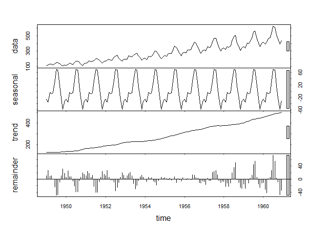
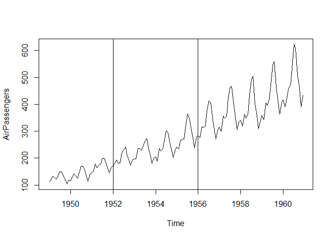

Series Temporales
================

## Definición

Colección de datos ordenados cronológicamente, los cuales serviran para
identificar, mediante su comportamiento y evolución, cual fue el proceso
generador de los datos PGD (a partir del comportamiento de dicha serie
se construye un modelo que intenta replicar la serie original)

``` r
plot(AirPassengers)
```

<!-- -->

## Principales componentes:

``` r
plot(stl(AirPassengers,s.window = "period"))
```

<!-- -->

1.- Componente tendencial(trend): Cambio a largo plazo que se produce a
nivel medio, cambio en la media a largo plazo.

2.- Componente ciclico: Dado un intervalo de tiempo, el comportamiento
de la misma decrece por debajo de la tendencia a largo plazo. Parte mas
complicada de modelar.

3.- Componente estacional(seasonal): Su coportamiento es recursivo o con
un patron que responde a las mismas fechas o puntos en el tiempo durante
algunos periodos. Patron sistemático.

4.- Componente Irregular(remainder): Parte estocástica o aleatoria, no
responde a ningun patron o coportamiento sistemático.

Los 3 primeros componentes son deterministicos y el componente irregular
es estocástico.

Nota: Procesos estocásticos: Es una sucesion de variables aleatorias
ordenadas en el tiempo.

### Terminos generales:

Un proceso estocástico es estacionario, en sentido debil, es aquel que
su media, al igual que su varianza, se mantiene(mas o menos) constante o
invariante a traves del tiempo.

Ejemplo tomemos la serie presentada anteriormente y dividamos en 3
grupos:

``` r
plot(AirPassengers)
abline(v = 1952)
abline(v = 1956)
```

<!-- -->

Si calculamos la media de cada grupo notaremos que las medias no son las
mismas.  
Para este modelo podriamos afirmar que la media no es constante a traves
del tiempo, para comprobarlo se tendria que hacer un prueba de
hipotesis.

``` r
kable(Tabla)
```

| media g1 | media g2 | media g3 |   var g1 |   var g2 | var g3 |
|---------:|---------:|---------:|---------:|---------:|-------:|
|  158.375 | 269.0417 | 269.0417 | 1094.665 | 3105.998 |   6162 |

Para este caso no se cumple el caso de estacionalidad de sentido debil.

### Definicion formal

Una serie de tiempo es una Secuencia de observaciones o mediciones de
una variable a lo largo de los puntos de tiempo igualmente espaciados.
{X_t:t=1,2,3,4,…}

donde X_t: es la observacion de la variable en el momento t.

t: denota el tiempo

y(t) =b0 + b1\*y(t-1) + M(t) …(1)

El objetivo de la serie de tiempo es incorporar variables rezagadas en
distintos periodos, para que podamos encontrar a traves de su
comportamiento a traves del tiempo, un proceso generador de datos.

Para (1) solo se tiene un rezago, y a este modelo se le denomina AR(1),
auto regresivo de orden 1

Generalizando:

y(t) =b0 + b1*y(t-1) + b2*y(t-2)+…+ bp\*y(t-p)+ M(t)

Se denomina AR(p); P rezagos.

Por otro lado tenemos los modelos de medias moviles rezagadas, estos
modelan la relacion entre la observacion actual y los errores rezagados
de la serie.

y(t) = a0 + a1\*e(t-1) + m(t)

A este modelo se le denomina MA(1)

Generalizando:

y(t) = a0 + a1*e(t-1) + … +Aq*e(t-q) + m(t), Se denomina MA(q)

Finalmente podriamos construir un modelo que contenga rezagos y errores
rezagados:

y(t) = a0 + b1*y(t-1) + a1*e(t-1) + m(t), se denomina ARMA(1,1)

Generalizando:

y(t) =Z0 + b1*y(t-1) + b2*y(t-2)+…+ bp*y(t-p) + a1*e(t-1) + …
+Aq\*e(t-q) + m(t), se denomina ARMA(p,q)

El objetivo es encontrar cuantos rezagos y medias moviles se tienen que
incorporar al modelo para poder replicar la variable original.
